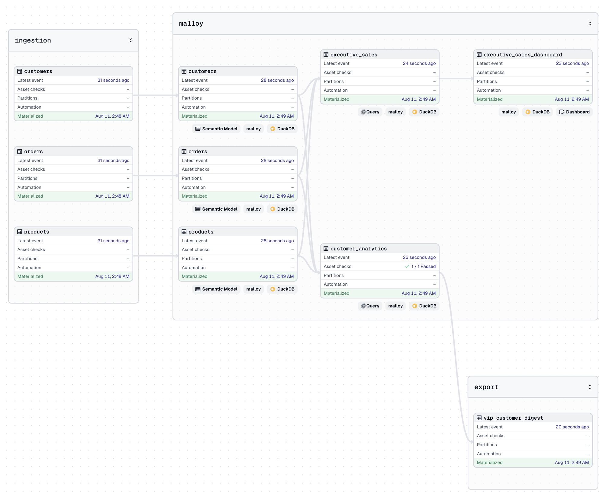

# dagster-malloy

`dagster-malloy` is an **unofficial** community integration library providing [Dagster](https://dagster.io) support for [Malloy](https://github.com/malloydata/malloy) models (`.malloy`) and notebooks (`.malloynb`).

## Features

- **Malloy as Dagster assets:** Expose Malloy queries, dashboards, and notebooks as Dagster assets including rich metadata (compiled SQL, DDL, Malloy source code, column schema, row preview, code references, and execution duration).
- **Warehouse-Native Materialization (CTAS/CVAS):** Execute compiled Malloy models directly inside target database warehouses (`DuckDB`, `BigQuery`, `Snowflake`, `Postgres`, `Redshift`) via `CREATE TABLE / VIEW AS <compiled_sql>` using Dagster database connection resources. Eliminates data egress and Python RAM bottlenecks.
- **In-Memory DataFrame Pattern:** Optionally stream or load small-to-medium query results as [Polars DataFrames](https://pola.rs) into Python for downstream machine learning or custom Python data assets.
- **Complete data lineage:** Automatically resolve Malloy source dependencies — including joined sources — to build a complete asset graph visible in the Dagster UI.
- **Data quality checks:** Write validation queries directly in Malloy and have them run automatically as Dagster [asset checks](https://docs.dagster.io/concepts/assets/asset-checks) — either inline during asset materialization or as standalone check definitions. In warehouse mode, checks run directly against database connections in milliseconds.

    ```malloy
    # Verify Customer IDs are non-null
    query: check_valid_customer_ids is orders -> {
      where: customer_id is null
      aggregate: invalid_count is count()
    }
    ```



## Quickstart

Try `dagster-malloy` using:

```bash
uvx dagster-malloy-demo
```

This generates a sample project (`./malloy_demo`) and launches the Dagster UI at [http://127.0.0.1:3000](http://127.0.0.1:3000).

## Installation

```bash
uv add dagster-malloy
```

## Usage

### 1. Warehouse-Native Materialization (Recommended for Production & ELT)

Use `execution_mode="warehouse"` to compile Malloy queries into dialect-optimized SQL and execute `CREATE TABLE / VIEW AS <sql>` directly in your warehouse using Dagster database resources (`DuckDBResource`, `BigQueryResource`, `SnowflakeResource`):

```python
from pathlib import Path
from dagster import Definitions
from dagster_duckdb import DuckDBResource
from dagster_malloy import load_malloy_assets, MalloyResource

# Materializes Malloy queries as tables directly in DuckDB warehouse
malloy_table_assets = load_malloy_assets(
    path=Path(__file__).parent / "models",
    execution_mode="warehouse",
    materialization_mode="table", # "table" (CTAS) or "view" (CVAS)
    db_resource_key="duckdb",
)

defs = Definitions(
    assets=[malloy_table_assets],
    resources={
        "malloy": MalloyResource(execution_mode="warehouse"),
        "duckdb": DuckDBResource(database="data/warehouse.duckdb"),
    },
)
```

### 2. Loading Malloy Assets (In-Memory / Auto Mode)

Use `load_malloy_assets` in `auto` mode for local development or Python data assets. Queries are executed and returned as `polars.DataFrame`:

```python
from pathlib import Path
from dagster import Definitions
from dagster_malloy import load_malloy_assets, MalloyResource

malloy_assets = load_malloy_assets(
    path=Path(__file__).parent / "models",
    include_checks=True,  # Default: True (registers inline asset checks)
)

defs = Definitions(
    assets=[malloy_assets],
    resources={
        "malloy": MalloyResource(cli_path="npx malloy-cli"),
    },
)
```

### 3. Using `MalloyProject`

Use `MalloyProject` to manage project paths, manifest location, and dev auto-compilation in a single object:

```python
from pathlib import Path
from dagster_malloy import MalloyProject, load_malloy_assets

project = MalloyProject(
    path=Path(__file__).parent / "models",
    manifest_path=Path(__file__).parent / "models" / "malloy_manifest.json",
    auto_recompile_if_stale=True,  # Default: True
)

malloy_assets = load_malloy_assets(project=project)
```

### 4. AST Manifests & Serverless / Python-Only Deployments

In production or serverless environments (Cloud Run, ECS, Kubernetes), you can eliminate **100% of the Node.js runtime dependency** for loading Dagster asset definitions by pre-compiling an AST manifest during CI/CD or Docker build.

#### Building the Manifest (CI/CD / Dockerfile):

Use the `dagster-malloy build-manifest` CLI command:

```bash
# Pre-compile Malloy AST metadata into analytics/malloy_manifest.json
dagster-malloy build-manifest analytics/ --output analytics/malloy_manifest.json
```

#### Loading Pre-compiled Manifests:

When `malloy_manifest.json` exists alongside your models (or when `manifest_path` is explicitly passed), `dagster-malloy` loads asset definitions in **pure Python (< 1ms)** without calling Node.js.

```python
malloy_assets = load_malloy_assets(
    path=PROJECT_ROOT / "analytics",
    manifest_path=PROJECT_ROOT / "analytics" / "malloy_manifest.json",
    use_manifest_if_exists=True,
)
```

### 5. Execution Modes Configuration

`dagster-malloy` supports three execution engine modes via `MalloyResource` or `load_malloy_assets`:

* **`"warehouse"`**: Compiles query to SQL and executes `CREATE TABLE/VIEW AS <sql>` directly via Dagster database resource. Zero data egress to Python.
* **`"cli"`**: Executes query via `malloy-cli run --json` and returns `polars.DataFrame`.
* **`"auto"` (Default)**: Resolves automatically to CLI or warehouse execution mode.

```python
resource = MalloyResource(
    execution_mode="warehouse",
    cli_path="npx malloy-cli",  # Path to malloy-cli binary or npx
    config_path="path/to/malloy-config.json",  # Optional path to database connections config
    project_dir="path/to/project",  # Optional project root for relative file paths
)
```

### 6. Connection Config & Dialect Resolution (`malloy-config.json`)

`dagster-malloy` automatically resolves custom connection identifiers (e.g. `orca.table(...)`) to their underlying database engine (e.g. `duckdb`) to assign clean kind badges in the Dagster UI and enrich asset metadata:

1. **Automatic Config Discovery**: `dagster-malloy` automatically discovers `malloy-config.json` in parent directories, or you can specify `config_path`:
   ```python
   malloy_assets = load_malloy_assets(
       path="./models",
       config_path="./malloy-config.json",
   )
   ```
2. **Database Resource Fallback**: In warehouse execution mode (`execution_mode="warehouse"`), passing `db_resource_key="duckdb"` provides an immediate fallback to infer the dialect and assign the appropriate kind badge without needing a `malloy-config.json` file.
3. **Lineage & Storage Metadata**: Both sources and queries are enriched with standard metadata keys: `malloy/connection`, `malloy/dialect`, `dagster/table_name`, `dagster/storage_kind`, and database/schema details from connection configurations.

### 7. Custom Translator (`MalloyTranslator`)

Subclass `MalloyTranslator` to customize asset keys, tags, group names, metadata, or upstream dependencies:

```python
from dagster import AssetKey
from dagster_malloy import MalloyTranslator, MalloyTranslatorData, load_malloy_assets


class CustomMalloyTranslator(MalloyTranslator):
    def get_asset_key(self, data: MalloyTranslatorData) -> AssetKey:
        return AssetKey(["analytics", data.query_info.name])

    def get_group_name(self, data: MalloyTranslatorData) -> str:
        return "malloy_models"


malloy_assets = load_malloy_assets(
    path="./models",
    translator=CustomMalloyTranslator(),
)
```

### 8. Data Quality Checks

Malloy check queries (starting with `check_`, `test_`, `assert_` or annotated with `# @check`) are automatically registered as inline Dagster asset checks by default (`include_checks=True`).

Alternatively, use `build_malloy_asset_checks` to register standalone asset check definitions attached to a target asset:

```python
from dagster import AssetKey
from dagster_malloy import build_malloy_asset_checks

checks = build_malloy_asset_checks(
    file_path="./models/sales.malloy",
    target_asset_key=AssetKey(["sales", "customer_analytics"]),
    execution_mode="warehouse",
    db_resource_key="duckdb",
)
```

A check **passes** when the query returns zero rows, or when the first row contains `invalid_count = 0` or `fail_count = 0`.

## Example Project

A self-contained runnable example project is available in [`dagster_malloy_demo`](dagster_malloy_demo) demonstrating DuckDB warehouse CTAS materialization, view materialization, and parameterized queries.

To run the example locally:

```bash
git clone https://github.com/mathisdrn/dagster-malloy.git
cd dagster-malloy/dagster_malloy_demo
uv run generate_data.py
uv run dg dev -f definitions.py
```

Open [http://127.0.0.1:3000](http://127.0.0.1:3000) to view the asset catalog and lineage graph.

## Contributing

Contributions, issues, and pull requests are welcome! Feel free to open an issue or submit a pull request on GitHub.