# dagster_malloy_demo

Demo project for [`dagster-malloy`](https://github.com/mathisdrn/dagster-malloy) — an e-commerce analytics pipeline built with Malloy models and Dagster assets.



## Project Structure

```
dagster_malloy_demo/
├── models/
│   └── sales.malloy       # Malloy model & query definitions
├── definitions.py         # Dagster definitions entrypoint
├── generate_data.py       # Script to generate sample Parquet datasets
├── cli.py                 # Demo launcher (dagster-malloy-demo entrypoint)
└── asset_lineage.svg      # Lineage diagram preview
```

## Quickstart

Run the demo directly without cloning:

```bash
uvx dagster-malloy-demo
```

This scaffolds a `malloy_demo/` directory, generates sample data, and starts the Dagster webserver at [http://127.0.0.1:3000](http://127.0.0.1:3000).

## Running from source

First clone the repository and install dependencies:

```bash
git clone https://github.com/mathisdrn/dagster-malloy.git
cd dagster-malloy
uv sync
```

Then, you can run the demo project using either the demo CLI or `dg` directly:

### Option A: Using the demo CLI (auto-scaffolding)

```bash
uv run dagster-malloy-demo
```

This scaffolds a `malloy_demo/` directory in your current path, generates sample data, and starts the Dagster webserver.

### Option B: Running directly in the source directory

```bash
cd dagster_malloy_demo
uv run generate_data.py
uv run dg dev -f definitions.py
```

## Options (Option A)

```
--port, -p   Port for Dagster webserver (default: 3000)
--host       Host address (default: 127.0.0.1)
--dir,  -d   Target demo directory name (default: malloy_demo)
```
